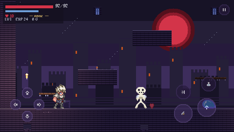

# Crimson Vespers

A gothic action-exploration Metroidvania for mobile, built in Godot 4.6.

Whip, leap and dissolve into mist through Castle Vhorn, whose locked doors open
to the abilities you find rather than the keys you carry.



---

## Running it

Requires **Godot 4.6**. No addons, no package manager, no build step.

```bash
godot --path .                    # play
godot --editor --path .           # open in the editor
```

On a machine with no GPU (CI, containers), force the compatibility renderer:

```bash
xvfb-run -a godot --path . --rendering-driver opengl3
```

## Controls

| Action | Keyboard | Gamepad | Touch |
|---|---|---|---|
| Move | Arrows / WASD | Left stick | D-pad, lower left |
| Jump | Space / C | A | Large button, lower right |
| Whip | X | X | Large button, lower right |
| Sub-weapon | Z | Y | Small button, upper right |
| Dash | Shift | B | Small button, upper right |
| Interact | Up | Y | D-pad up |
| Map | Tab | L1 | via pause |
| Pause | Esc | Start | Top-right corner |

Touch controls appear automatically on devices with a touchscreen, and their
size and opacity are adjustable.

## The route

Roughly 15–20 minutes from the gate to the boss.

1. **Outer Ward** → the Entrance Hall, where a ledge is out of reach.
2. East along the ground floor to the **Chapel Landing** — first save, Silver Dagger.
3. Through the **Bat Gallery** to the **Vault of the Twin Step** — double jump.
4. **Backtrack** to the Entrance Hall; the ledge is now reachable.
5. Up the **Clocktower Stair** to the **Vault of Mist** — Mist Dash.
6. Through the **Long Gallery**'s mist gate to the **Throne of Ash** — the boss.

## Project layout

```
assets/
  art/          generated + imported sprites, atlases and manifests
  audio/        music and SFX
  data/
    game_balance.json      every tuning value in the game
    rooms/room_*.json      ASCII level layouts
  fonts/
src/
  core/         autoload services, combat math, resource builders
  gameplay/     player, enemies, combat, world, items, vfx
  ui/           HUD, touch controls, screens
tests/
  unit/         formula and data suites
  integration/  builds every room for real
tools/
  asset-pipeline/   art generation and pack import
  ci/               room validator
  debug/            screenshot + smoke harness
design/         game concept, GDDs, art bible, level design
docs/architecture/  ADRs and the control manifest
```

## Verifying a change

```bash
# 1. Level data (fast, runs before the engine)
python3 tools/ci/validate_rooms.py

# 2. Unit + integration suites (headless)
godot --headless --path . res://tests/test_runner.tscn

# 3. Runtime smoke test + screenshots
xvfb-run -a godot --path . --rendering-driver opengl3 \
    res://tools/debug/capture_scene.tscn -- --out=/tmp/shots
```

All three are green: 11 rooms validated, 109 tests / 1173 assertions passing,
17 screenshots captured.

## Regenerating assets

```bash
python3 tools/asset-pipeline/generate_assets.py     # procedural placeholders
python3 tools/asset-pipeline/import_pack_assets.py  # third-party pack import
```

Both are deterministic — re-running produces identical bytes, so regeneration
never churns the diff.

## Where the design lives

| Question | Document |
|---|---|
| What is this game? | `design/game-concept.md` |
| How does combat work? | `design/gdd/combat-system.md` |
| How does movement work? | `design/gdd/traversal-moveset.md` |
| How do stats and levelling work? | `design/gdd/progression-and-stats.md` |
| How do the touch controls work? | `design/gdd/mobile-controls.md` |
| How is the castle laid out? | `design/levels/room-graph.md` |
| What should the art look like? | `design/art-bible.md` |
| Why is the code like this? | `docs/architecture/ADR-*.md` |
| How does the rendering stack work? | `docs/architecture/ADR-007-rendering-and-lighting.md` |
| What are the coding rules? | `docs/architecture/control-manifest.md` |

## Rendering

The castle is lit rather than flat: a per-room `CanvasModulate` sets the ambient,
torches and relics cast flickering point light, and on desktop the player's
lantern casts real shadows off the masonry. Cost is governed centrally by
`LightingQuality`, which drops to a no-shadow tier on mobile and hands out lights
from a per-room budget.

Characters share one effects shader for hit flash, death dissolve and the mist
form. Rooms that declare `showsSky` get a three-layer parallax castle skyline
behind them, deliberately dimmer than the playfield so scenery never competes
with platforms.

## Credits

Character art, audio, font and several UI sprites come from a supplied
Metroidvania asset pack; the raw pack is kept in the
`Game-Assets-And-Resources` repository. Tileset, bestiary, props, VFX and UI
plates are generated procedurally by this repository's asset pipeline. See
`design/art-bible.md` §4 for the full breakdown.
